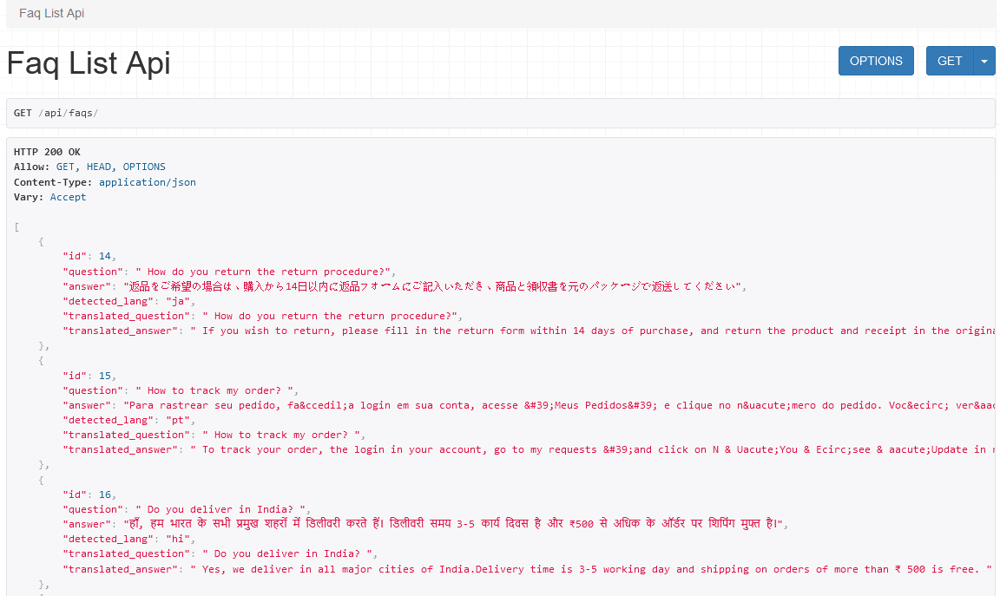
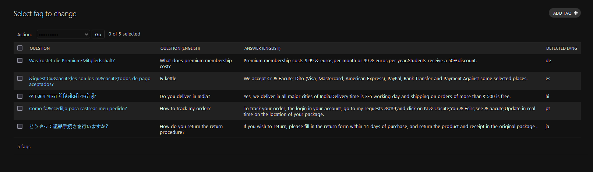
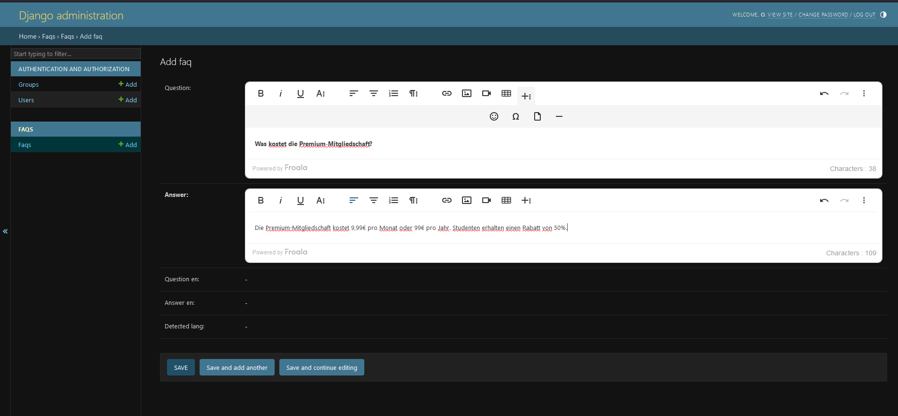

# BharatFD - Multilingual FAQ Backend
A multilingual FAQ system built with Django, featuring automated language detection and translation capabilities. It supports more than 40 languages, including both Indian and foreign languages.

## ✨ Key Features


## 📦 Installation & Setup

1. **Clone the Repository**
   ```bash
   git clone https://github.com/yourusername/django-faq-system.git
   cd django-faq-system
   ```

2. **Create a Virtual Environment**
   ```bash
   python -m venv venv
   source venv/bin/activate  # On Windows: venv\Scripts\activate
   ```

3. **Install Dependencies**
   ```bash
   pip install -r requirements.txt
   ```

4. **Apply Migrations**
   ```bash
   python manage.py makemigrations
   python manage.py migrate
   ```

5. **Create a Superuser**
   ```bash
   python manage.py createsuperuser
   ```

6. **Run the Server**
   ```bash
   python manage.py runserver
   ```

## 🔧 Configuration

### Environment Variables

Create a `.env` file in the project root:

```env
DJANGO_SECRET_KEY=your_secret_key_here
DEBUG=True
ALLOWED_HOSTS=127.0.0.1,localhost
```

### CKEditor Configuration

Add to your settings.py:

```python
CKEDITOR_CONFIGS = {
    'default': {
        'toolbar': 'full',
        'height': 300,
        'width': '100%',
    }
}
```

## 🎯 API Endpoints

### Get All FAQs
```http
GET /api/faqs/
```

Response:
```json
[
  {
    "id": 1,
    "question": "¿Qué es Django?",
    "question_lang": "es",
    "translated_question": "What is Django?",
    "answer": "Django es un framework de Python.",
    "answer_lang": "es",
    "translated_answer": "Django is a Python framework."
  }
]
```


### Create an FAQ
```http
POST /api/faqs/
```

Request body:
```json
{
  "question": "Was ist Django?",
  "answer": "Django ist ein Web-Framework für Python."
}
```

### Update an FAQ
```http
PUT /api/faqs/{id}/
```

### Delete an FAQ
```http
DELETE /api/faqs/{id}/
```

## 🧪 Testing & Code Quality

### Run Tests
```bash
python manage.py test
```

### Check Code Quality
```bash
pip install flake8
flake8 --max-line-length=100
```




## 📜 Project Structure


## ✨ Author

**Pratik Prajn**  
📧 pratikpjn@gmail.com

## Happy Coding! 🚀
